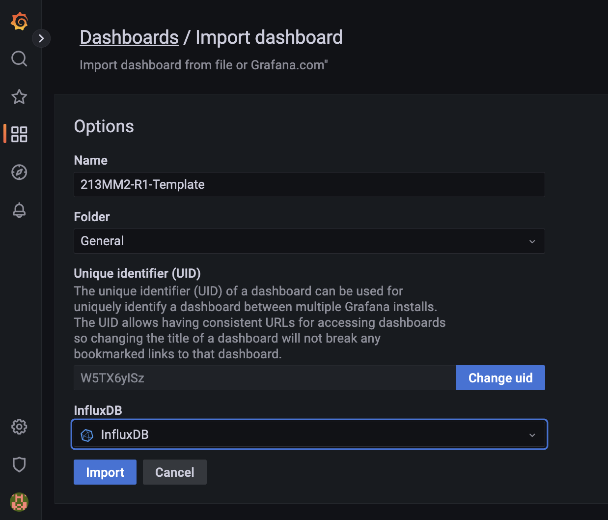

# MCM Gateway

Please download the repository into gateway and follow the instructions for deployment.

## Required

Install essential tools for automatic installation

```bash
./install_tools.sh
```

Install a specific version of the docker engine for Edge Xpert

```bash
./install_docker.sh
```

> [!IMPORTANT]
> Before moving to the next step. Please reboot the gateway after the docker installation is completed.


Install a specific version of Edge Xpert and License

```bash
./install_edgexpert.sh <LICENSE_PATH>
```

For example,

```bash
./install_edgexpert.sh ./EdgeXpert_eval_Evaluation.lic
```

## Deploy Gateway

The script provide required one mandatory parameter for sensor type and one option parameter for testing mode. To see the parameter options by perform following instruction.

```bash
./deploy.sh
```

Indicator shows the first parameter as sensor types as **modbus** **mqtt** or **both**. The script will deploy the necessary services.

```bash
Error: Not enough arguments supplied.
Usage: ./deploy.sh SENSOR_TYPE [TEST]
Available SENSOR_TYPE options: modbus / mqtt / both

The TEST variable can only have two values: --test or an empty string. It is used to enable the test mode when set to --test, while leaving it empty represents the product deployment.
```

For example, to deploy MCM gateway with Modbus RTU sensor

```bash
./deploy.sh modbus
```

The script can help to complete 90% setting automatically, except Grafana dashboard, due to Grafana API issue. Please find specific dashboard from folder ./mcm-gateway/config/grafana and import into Grafana manually



## Upgrade Software

To navigate to the folder containing 'docker-compose.texol.yml' file on your Linux system, follow these steps:

1. Open a terminal window.

2. Use the 'cd' command to change into the folder where 'docker-compose.texol.yml' is located. Replace "relative/path/to/your/folder" with the actual relative path:

   ```bash
   cd <relative/path/to/your/folder>
   ```

3. use following instruction to upgrade EdgeXpert from internet.

   ```bash
   export EDGEXPERT_PROJECT=texol

   edgexpert pull core-keeper core-metadata core-data core-command mqtt-broker redis xpert-manager sys-mgmt influxdb grafana

   edgexpert up xpert-manager sys-mgmt influxdb grafana

   docker image prune -f
   ```
